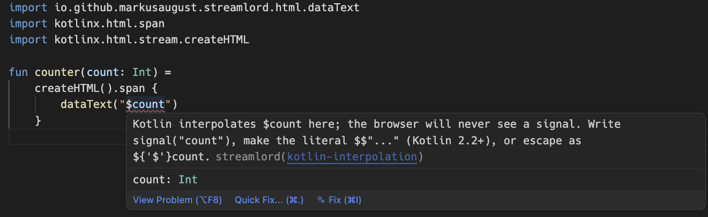

> *Every soul in Gallowmark knows my name, and not one knows my face. I took three rubies from
> the Iron Crown of Kell and the land fell apart in my hands. Now I will take one thing from you:
> the belief that the browser must be bought with JavaScript.*
>
> Sarn the Faceless, whom the river-priests of Thurn call the Lord of Streams

Streamlord is a [Datastar](https://data-star.dev) toolchain for Kotlin, and it comes in two
halves. The SDK speaks the Datastar 1.0.4 Server-Sent Events protocol: your server sends HTML and
signal patches down one connection, and the browser applies them. There is no client bundle of
yours to build, no JSON API to design, and no second model of your page living in a framework.

The other half is the one no other Datastar library on the JVM has. Datastar lives inside
attribute values and inside Kotlin strings, where no compiler looks, so Streamlord looks instead:
in your editor as you type, when the event is built, and before a byte reaches the browser.



That is `dataText("$count")` in VS Code. It compiles, because `count` is a parameter, and it would
send the browser whatever number `count` held instead of the signal `$count`. The editor marks it as an error before you
build, and the quick fix rewrites it to `signal("count")`. The same check runs in IntelliJ, and
[in CI](/testing/) as a test you add, with no editor at all.

## The same endpoint, twice

One route that adds a line to a list and updates a counter. First by hand, against the protocol:

```kotlin sample=ktor-routing
get("/feed") {
    call.response.header("Cache-Control", "no-cache")
    call.response.header("X-Accel-Buffering", "no")
    if (call.request.local.version == "HTTP/1.1") call.response.header("Connection", "keep-alive")
    call.respondBytesWriter(ContentType.Text.EventStream) {
        writeStringUtf8("event: datastar-patch-elements\n")
        writeStringUtf8("data: selector #feed\n")
        writeStringUtf8("data: mode append\n")
        writeStringUtf8("data: elements <li>A new head hangs on the wall</li>\n\n")
        flush()
        writeStringUtf8("event: datastar-patch-signals\n")
        writeStringUtf8("data: signals {\"heads\":13}\n\n")
        flush()
    }
}
```

Then with Streamlord:

```kotlin sample=ktor-routing
get("/feed") {
    call.respondDatastar {
        patchElements(selector = "#feed", mode = ElementPatchMode.APPEND) {
            li { +"A new head hangs on the wall" }
        }
        patchSignals("heads" to 13)
    }
}
```

Both send the same headers and the same bytes, one event at a time. The difference is what the
first one leaves to you:

- **Flushing.** Every event needs its `flush()`. Leave one out and the event waits in a buffer
  until the next flush or the end of the response, which on a stream that stays open can be
  minutes. Streamlord flushes after every event.
- **Markup over several lines.** Every line needs its own `data: elements` prefix. Write
  `"data: elements $html\n"` with a newline inside `html`, and every line after the first is
  dropped; a blank line inside it ends the event early. Streamlord splits it for you.
- **A mode that needs a selector.** `mode append` without a `selector` line goes out by hand.
  Streamlord refuses to build it and throws `DatastarEventValidationException` where the event is
  constructed, before a byte of it is written.
- **The JSON.** By hand you write the signals and escape them yourself. Streamlord encodes
  `"heads" to 13`, or a data class through a [codec](/signals/).
- **The headers.** `Cache-Control: no-cache` because the specification asks for it,
  `X-Accel-Buffering: no` because nginx holds the stream back without it, and
  `Connection: keep-alive` on HTTP/1.1 only, because HTTP/2 forbids it. `respondDatastar` sets
  all three and reads the protocol version itself.

## Three ways to write markup

The DSL above is one of three, and none of them is the real one with the others tolerated beside
it. The same patch inside `respondDatastar`, written each way:

```kotlin tab="kotlinx.html DSL" group=markup label="Markup style" sample=stream
patchElements(selector = "#feed", mode = ElementPatchMode.APPEND) {
    li { +"A new head hangs on the wall" }
}
```

```kotlin tab="String" group=markup sample=stream
patchElements(
    """<li>A new head hangs on the wall</li>""",
    selector = "#feed",
    mode = ElementPatchMode.APPEND,
)
```

```kotlin tab="Template" group=markup sample=stream
patchElements(
    pebble.render("feed/head.peb", mapOf("text" to "A new head hangs on the wall")),
    selector = "#feed",
    mode = ElementPatchMode.APPEND,
)
```

The template tab renders `feed/head.peb`, which holds `<li>{{ text }}</li>`. Every entry point
that takes HTML takes a `String`, so a template engine needs no integration: render, then pass
the result. [Choosing a style](/choosing-a-style/) compares them.

## What you get

**Two realms, served without favour.** Ktor is the Sword, Spring is the Shield. Neither is the
port the other was bolted onto: both are adapters over the same core, and Ktor and Spring WebMVC
put identical bytes on the wire.

**An encoder that cannot be talked into lying.** Eight patch modes exist, and every mode except
`outer` and `replace` requires a selector. Streamlord refuses to construct an event the client
would reject, at the point you construct it, rather than letting you discover it in a browser
console.

**Editors that read Datastar as a language.** A VS Code extension and an IntelliJ plugin colour
signals, actions and modifiers inside your Kotlin and your HTML, and say so when a modifier is
misspelled. The code on this site is highlighted by the very same grammars.

## What it costs you

Almost nothing, and that is deliberate. The core carries the Kotlin standard library and
coroutines, and nothing else, not even a JSON library, because it has its own strict RFC 8259
parser and writer. The framework adapters compile against your framework and add no version of
their own. You reach for a codec module only when you want data classes as signals.

```kotlin sample=none
dependencies {
    implementation("io.github.markusaugust.streamlord:streamlord-ktor:0.11.0")
    implementation("io.github.markusaugust.streamlord:streamlord-html:0.11.0")          // optional
    implementation("io.github.markusaugust.streamlord:streamlord-json-kotlinx:0.11.0")  // optional
}
```

## What it does not do

It does not render your pages for you, and it has no opinion about how you build HTML beyond
giving you three ways to do it. It does not ship Datastar itself: the client bundle is yours to
include, from a CDN or from your own static files. It does not ship Datastar Pro, and it never
will; the Pro helpers emit the documented attribute names and nothing more, and the bundle and
the licence are yours to bring.

And it does not guess. Where the protocol is ambiguous, Streamlord refuses rather than picks.

> *The stream was always yours to bend. Sit. Read.*
